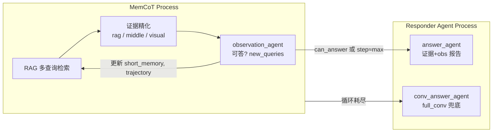

# MemCoT：`MemCoT.run` 架构说明

本文描述 [`memcot.py`](../memcot.py) 中 **`MemCoT` 类与 `run()`** 的职责、数据流与模块边界，并给出 **MemCoT Process** 与 **Responder Agent Process** 的划分方式，便于后续重构、评测对接或拆进程部署。

---

## 1. 角色概览

`MemCoT.run()` 实现一条 **ReAct 风格** 的长对话问答流水线：在固定上限步数内，反复 **检索（Act）→ 判据与续查（Observation）→ 轨迹记录（Thought）**，必要时进入 **最终作答**。检索后端可为 NaiveRAG（pkl 向量）或 LightRAG（图谱混合检索），由 `rag_type` 选择。

**返回值（字典）**包括：`answer`、`answer_thinking`、`stopped_reason`（`can_answer` 或 `max_step`）、`steps`、`final_evidence`、`final_query_queue`、`trajectory`，并写入 `output_dir/result.json`。

---

## 2. 依赖与外围设施

| 类别 | 说明 |
|------|------|
| **检索** | `build_rag_retrieve(rag_type, working_dir, top_k, conv_id, rag)` 创建 retriever，循环内统一调用 `retriever.retrieve_multi(query_queue)` |
| **Agent** | `agent.agent`：`rag_view_agent`、`middle_view_agent`、`visual_ocr_agent`、`observation_agent`、`answer_agent`、`conv_answer_agent` 等 |
| **Benchmark** | `benchmark` 控制 prompt 与上下文构造；`longmemeval` 时对 query 做第一人称改写并解析 `haystack_session_ids` |
| **全量对话** | `full_conv` 仅在循环耗尽后由 `conv_answer_agent` 使用（需非 `None`） |
| **开关** | `agent_flag_str` 五位 `0/1` 控制 rag_view / middle_view / visual_ocr 等是否启用（与 CLI 说明一致） |

---

## 3. `MemCoT.run` 内部状态（跨步维护）

初始化阶段（约 ```382:403:memcot.py```）建立：

- **`root_query` / `query`**：根问题；LongMemEval 下会改写 query。
- **`query_queue`**：当前轮待检索的子查询列表；每步由 `observation_agent` 的 `new_queries` 整体替换。
- **`short_memory`**：跨步累积的「已采纳」证据片段（`dia_id` 级），供后续 agent 与最终作答使用。
- **`trajectory`**：每步一条 `{ Act, Observation, Thought }`，对应 ReAct 轨迹。
- **`fail_queue_trajectory`**、`conv_memory`、`visual_seen_session` 等：辅助 observation 与其它视图 agent。

---

## 4. 主循环（单步语义）

每一步（`for step in range(1, max_step + 1)`，约 ```405:591:memcot.py```）顺序为：

1. **Act — 检索**  
   `self.ragretriever.retrieve_multi(query_queue)` → `rag_results`（去重后的证据列表）。当前实现要求 `len(rag_results) != 0`（见断言）。

2. **Act — 证据精化（可选，受 `agent_flag` 控制）**  
   在 `rag_results` 上串联可选模块，结果写入 `temp_useful_rag` 与 `rag_record`：  
   - `rag_view_agent`：从粗检索中筛「有用证据」并给出缺失信息描述。  
   - `middle_view_agent`：在会话窗口内扩展/精炼证据（`K = middle_scale`）。  
   - `visual_ocr_agent`：非 `longmemeval` 时可选，结合图像会话视图。

3. **Act 记录**  
   `act_record`：步号、`query_queue`、`rag_record`、`temp_useful_rag_dia_ids`。

4. **Observation**  
   `observation_agent(...)` → `can_answer`、`useful_evidence`、`new_queries`、`action`、`thinking` 等；并根据 `useful_evidence` 更新 `short_memory`。

5. **轨迹落盘**  
   `trajectory.append({ Act, Observation, Thought })`，其中 `Thought` 取自 observation 的 `thinking`。

6. **查询队列推进**  
   `assert len(new_queries) != 0`，然后 `query_queue = new_queries`（进入下一轮检索目标）。若本步判定可答或到达 `step == max_step - 1`，则进入 **Responder**（见下节）。

7. **循环结束后的回退**  
   若未提前返回，则 `assert full_conv != None` 后调用 `conv_answer_agent`，以整段对话为上下文给出答案，`stopped_reason` 为 `max_step`（约 ```592:622:memcot.py```）。

---

## 5. 过程划分：MemCoT Process vs Responder Agent Process

划分原则：**MemCoT Process 负责「为回答问题而持续检索与整理证据」；Responder Agent Process 负责「在已有约束下生成对用户可见的最终答案」**。二者通过 **结构化的 observation 输出** 与 **`short_memory` 证据集** 交接。

### 5.1 MemCoT Process（记忆与检索推理过程）

**范围（建议定义）**

- **输入**：`root_query`、`query_queue`、benchmark 相关元数据、`short_memory` 历史、上一轮轨迹摘要（如 `last_queries`）。
- **核心动作**：  
  - 多查询 RAG 检索；  
  - 可选多阶段证据裁剪与扩展（rag / middle / visual）；  
  - **Observation**：判断是否已具备作答条件、哪些 `dia_id` 可信、**下一步检索子问题 `new_queries`**；  
  - 更新 `short_memory`、`trajectory`、`query_queue`。
- **输出（对接 Responder 的契约）**：  
  - `can_answer`（布尔）；  
  - `short_memory`（证据子图）；  
  - `obs_thinking`（observation 的推理，供作答时引用）；  
  - `new_queries`（MemCoT 继续检索时用；一旦进入 Responder，最终以 `answer_agent` 或 `conv_answer_agent` 的结果为准）。

**在代码中的对应片段**：从循环开始到 `observation_agent` 完成、并更新 `trajectory` 与 `query_queue` 为止；即 **不包含** `answer_agent` / `conv_answer_agent` 调用。

**本质**：这是一个 **封闭的「检索—判断—再检索」控制回路**，目标是最大化 `short_memory` 中与问题相关的可验证证据，直到 observation 认为可答或步数逼近上限。

### 5.2 Responder Agent Process（最终作答过程）

**范围（建议定义）**

- **触发条件 1（早停作答）**：`obs["can_answer"] or step == max_step - 1`（约 ```568:591:memcot.py```）。  
  - 调用 **`answer_agent`**：`query`、`short_memory`、`obs_report=obs_thinking`、`additional_information`（来自 `category`）等。  
  - 若答案非空且不在 `WRONG_LIST`，返回 `stopped_reason="can_answer"`，并保存 `result.json`。
- **触发条件 2（兜底全对话）**：主循环正常结束仍未返回成功答案时。  
  - 调用 **`conv_answer_agent`**：基于 **`full_conv`** 生成答案，`stopped_reason="max_step"`。

**在代码中的对应片段**：上述两处 LLM 调用及其结果组装、写盘与 `return`。

**本质**：**不再扩展检索队列**，只在给定证据（`short_memory` + observation 报告）或全量对话（`full_conv`）上 **生成最终自然语言答案**。

### 5.3 边界示意图



---

## 6. 实现层面的注意点（便于对齐设计）

- **`query_queue` 与 `new_queries`**：每步 observation 必须给出非空的 `new_queries`，否则断言失败；这与「仅当不能回答时才续查」的直觉需在 prompt 层保持一致。  
- **`final_query_queue`**：早停路径中返回的是更新前的 `query_queue_last`（约 ```566:586:memcot.py```），与「本步用于检索的队列」语义一致，便于对齐日志。  
- **`middle_view_agent`**：当前调用未传入 `full_conv`；若 LongMemEval 下 middle 窗口依赖全对话上下文，需在 agent 层与 MemCoT Process 契约中显式补齐（与异步版等变体对齐时尤需注意）。  
- **`img_retriever`**：CLI 会创建并传入 `MemCoT(...)`，但 `run()` 内未直接使用；视觉检索若启用，应在 MemCoT Process 内与 `agent_flag` 设计对齐。

---

## 7. 小结

| 过程 | 主要职责 | 代码锚点 |
|------|----------|----------|
| **MemCoT Process** | 检索、证据精炼、可否回答判断、子问题生成、状态与轨迹更新 | `MemCoT.run` 循环内至 `trajectory.append` 与 `query_queue` 更新 |
| **Responder Agent Process** | 基于证据或全对话输出最终答案 | `answer_agent`（早停）与 `conv_answer_agent`（兜底） |

将系统拆为两个进程或两个服务时，建议以 **observation 的输出结构** + **`short_memory` 快照** 作为跨边界 API，Responder 侧只读这些输入并返回答案与可选 `answer_thinking`，避免在作答阶段再次改写检索状态。

---

## 8. `MemCoTExit` 与 `finalize_memcot_exit`（[`memcot.py`](../memcot.py)）

`MemCoT.run()` 返回 **`MemCoTExit`**（`kind` 为 `evidence_ok` 或 `fallback`）。**`prompt`** 已在返回前用 `return_answer_agent_prompt` / `return_conv_answer_agent_prompt` 拼好；**`model` / `benchmark`** 供 `finalize_memcot_exit` 里 `run_chatgpt` 与解析分支使用。

- **`evidence_ok`**：另含循环内 `try_responder_answer_from_evidence` 得到的 `answer` / `answer_thinking`（记录用）、`steps`、`final_evidence`、`final_query_queue`（更新前的 `query_queue`）。
- **`fallback`**：另含 `full_conv`、`max_step`、最终 `final_evidence` 与 `final_query_queue`。

**`finalize_memcot_exit(exit_state)`** 仅读 `exit_state.prompt` 再 `run_chatgpt` 并写 `result.json`（`evidence_ok` 走与 `answer_agent` 一致的 JSON 解析；`fallback` 等价原 `conv_answer_agent` 的短输出）。`prompt` 未设置时会 `raise ValueError`。CLI 在 `try` 中依次调用 `MemCoT(...).run(...)` 与 `finalize_memcot_exit`。
